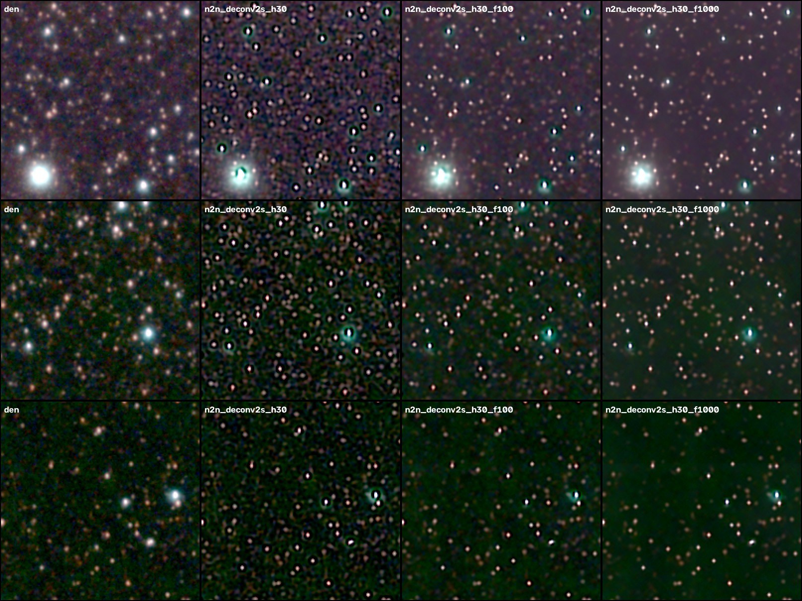
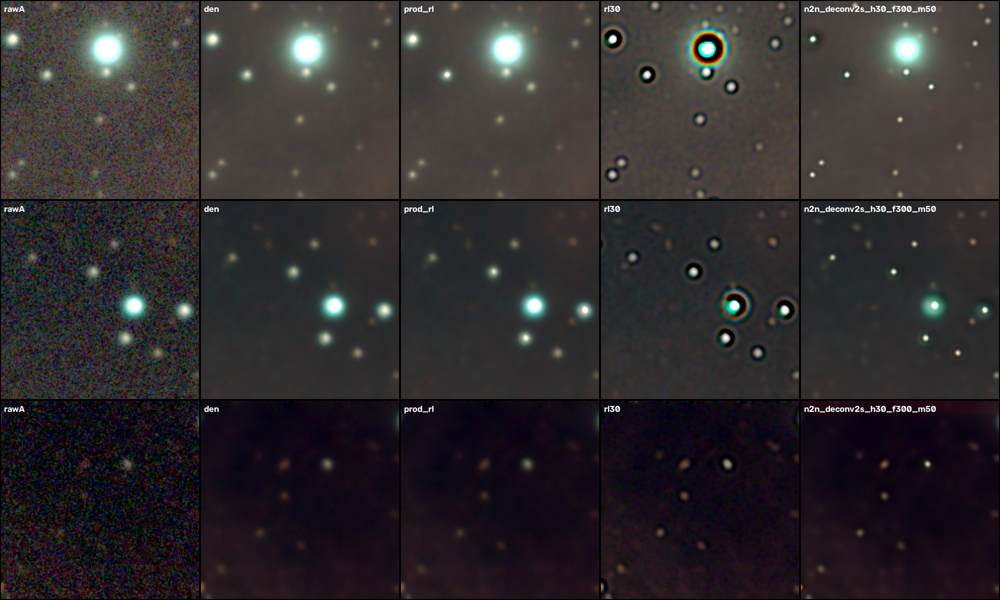
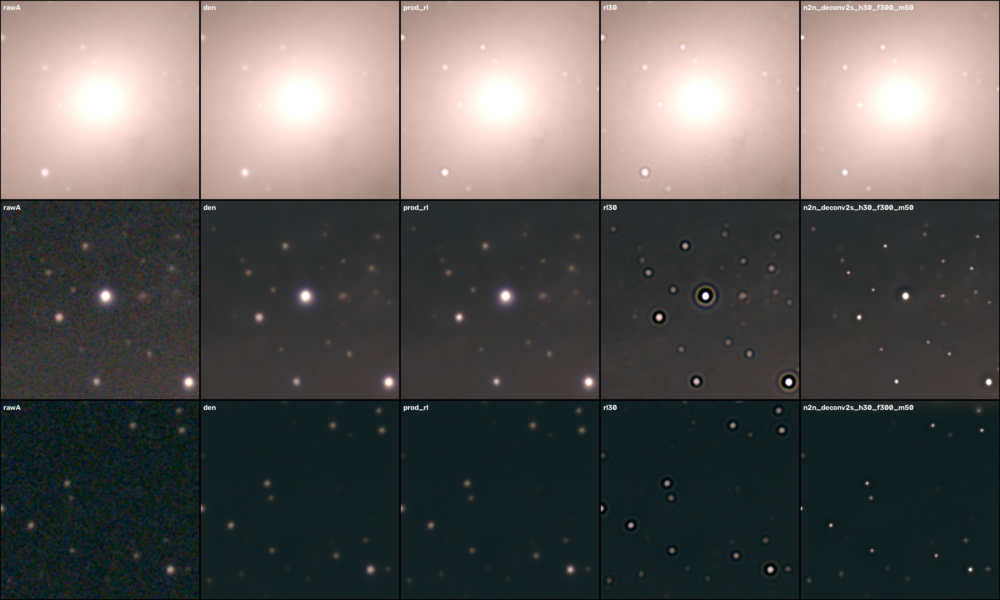

# ML restoration experiments

This folder has the benchmark harness and the results behind the AI denoise and
deconvolution stage in `astrophoto/denoise.py`. Everything here is reproducible
from the cached half-stacks in `output/`.

## How to score a method without ground truth

The stacker writes two **half-stacks** (even and odd frames): the same sky with
independent noise. Each method sees only half A, and is trained only on two of every
three 256 px vertical bands. Its estimate x̂ is then compared with half B on the
held-out bands. Because B's noise is independent of everything the method saw,

    E|x̂ − B|² = E|x̂ − x|² + σ_B²

so subtracting B's measured noise variance gives the **true error** of x̂, with no
clean image needed. For deconvolution the same identity applies after re-blurring
by the measured PSF k: E|k∗x̂ − B|² − σ_B² (the fidelity score).

Every score is quoted in units of one half-stack's noise variance:
**1.0 = no better than the raw half, lower is better**. Each is computed in two ways:

* **lin**: linear, inverse-variance weighted. Dominated by stars and bright structure.
* **str**: in an asinh-stretched domain. This is what faint nebulosity looks like
  after stretching.

Deconvolution is also scored on:
* median **FWHM** of isolated stars
* **ringing**: azimuthal profile minimum / peak
* **moat**: undershoot below the local sky, in sky-noise σ
* **background noise** in faint star-free regions, relative to the denoised input

`viz.py` renders the same stretch of every method side by side for a visual check.

Test crops: the deepest 1536² region of M 27 (LP filter, planetary nebula) and
IC 5070 (LP filter, emission nebula), and the deepest 2048² region of M 31 (IRCUT
broadband, galaxy, 2× drizzle).

## Denoising (`exp_denoise.py`)

Noise2Noise training, A↔B (Lehtinen et al. 2018, arXiv:1803.04189), in the asinh
variance-stabilised domain, 2000 steps. Scores are dB of error reduction relative
to raw half A, M 27:

| Method | lin | str | Notes |
|---|---|---|---|
| Non-local means (classic) | +3.9 dB | +5.9 dB | tuned to the measured noise |
| **U-Net (production)** | **+6.9 dB** | **+7.3 dB** | 0.47 M params |
| U-Net + 8× self-ensemble (Timofte et al. 2016, arXiv:1511.02228) | **+7.0 dB** | **+7.4 dB** | +5 s of inference, **adopted** |
| U-Net, 2× training steps | +6.8 dB | +7.2 dB | overfits slightly |
| Wider 4-level residual U-Net | +6.2 dB | +7.2 dB | more capacity doesn't help |
| NAFNet (Chen et al. 2022, arXiv:2204.04676) + 8× self-ensemble | +5.5 dB | +7.4 dB | ties on faint signal, worse on stars, 4× slower to train |
| ZS-N2N 2-layer net (Mansour & Heckel 2023, arXiv:2303.11253) | +6.0 dB | +7.0 dB | only 2 min: most of the gain comes from training on the data itself |

The noise in one night's stack is simple enough that a compact U-Net is already
near the limit of what these data allow. Averaging the network over the 8
rotations and flips is the one free improvement, and it is on in production.
The recent astro papers point the same way: AstroSURE (arXiv:2604.16793) uses a
~1 M-parameter U-Net and reports that Noise2Noise nearly matches supervised
training when paired exposures exist, as they do here.

## Deconvolution (`exp_deconv.py`)

Every method gets the N2N-denoised half A and per-channel PSFs measured from the
stars. The PSFs differ a lot between colours: on IC 5070 the red (Hα) PSF covers
about twice the area of the green one, because refractors focus colours
differently.

| M 27 (FWHM 4.22 px) | fidelity lin / str | FWHM | ringing | moat | bg noise |
|---|---|---|---|---|---|
| Denoised only (not deconvolved) | 0.20 / 0.19 | 4.22 | 0 | – | ×1.0 |
| Old production RL + TV, masked | 1.70 / 0.38 | 4.08 | 0 | – | ×1.0 |
| Plain Richardson–Lucy, 30 it | 0.45 / 0.21 | 2.35 | −2.5% | – | ×2.9 |
| DPIR plug-and-play (arXiv:2008.13751), N2N-trained conditional prior | 2.9 / 0.35 | 3.22 | 0 | – | ×0.29 |
| N2N deconv net, 1-stage | 0.37 / 0.22 | 2.05 | −1.7% | – | ×4.3 |
| + Hessian 0.3 | 0.40 / 0.23 | 2.27 | −1.2% | – | ×1.8 |
| 2-stage (input = denoised half), Hessian 0.3 | 0.41 / 0.23 | 2.13 | −1.2% | – | ×1.8 |
| **+ sky-floor prior (3.0, margin 0.5σ)**, adopted | 0.51 / 0.24 | **2.29** | **0** | **+0.2σ** | **×0.97** |

| Adopted method vs alternatives | IC 5070 (FWHM 6.95 px) | M 31 (FWHM 5.98 px) |
|---|---|---|
| Old production RL | 6.38 px, fid 3.41 | 5.47 px, fid 0.82 |
| Plain RL 30 it | 3.76 px, **moat −56σ**, bg ×2.2 | 3.46 px, **moat −53σ**, bg ×1.7 |
| **N2N deconv (adopted)** | **2.83 px**, moat −0.6σ, bg ×0.54 | **2.35 px**, moat −0.9σ, bg ×0.72 |


*M 27, same stretch: denoised only, then N2N deconvolution without the sky floor
(dark moats), then with floor weight 1 and 10.*



*Raw half, denoised, old production RL, plain RL (ringing), adopted N2N deconvolution.*

**What worked.** The **Noise2Noise deconvolution network** is our adaptation of
ZS-DeconvNet (Qiao et al., Nat. Commun. 2024). ZS-DeconvNet trains on re-corrupted
copies of a single image; we train on the genuinely independent half-stacks. The
network receives the denoised half A and outputs x. Its loss is

    χ²(k ∗ x, raw half B)  +  0.3·|Hessian(asinh x)|²  +  3·|max(0, sky − 0.5σ − x)/σ|²

The χ² can only fall if x is closer to the true, sharper sky. The Hessian term
(from ZS-DeconvNet) and the **sky-floor prior** constrain what the PSF cannot see.
The sky-floor prior is our addition: real flux is never below the local sky.

Three observations led to the final design:

1. **χ² normalisation matters.** With an un-normalised weighted MSE the Hessian
   term was 10⁴× too small to do anything.
2. **Two-stage beats one-stage.** Feeding the denoised half, as ZS-DeconvNet
   does, gave sharper stars and less noise at the same regularisation.
3. **The sky floor removes dark moats.** Without it the network, like RL, dug
   dark moats around stars. Those are invisible in linear numbers but obvious
   after stretching.

**What didn't work.**

* **Plain Richardson–Lucy:** too noisy, with deep ringing.
* **Old masked RL:** safe but almost no effect.
* **SNR-gating any method:** cleaner background, but it gives back most of the sharpening.
* **DPIR:** a noise-level-conditional denoiser trained on one night's data isn't
  well enough calibrated across noise levels to act as a plug-and-play prior. It
  either over-smoothed or left stars blurred, with fidelity 2–6× worse.

**Found in full-pipeline testing.** Around bright stars and tight groups, where the
real PSF is wider than the median PSF, the network left a smooth undershoot of
about 0.6σ over a disk about 15 px wide. The benchmark missed it (it measures
isolated stars), but a hard stretch shows it as a dark disk. Production now clamps
the output at min(denoised, local median sky over 3 PSF widths) (`deconv_floor`),
which removes it and leaves dark lanes alone.

## ImageMM (arXiv:2501.03002) on the individual subs

`astrophoto/imagemm.py` implements ImageMM (Sukurdeep, Budavári, Connolly & Navarro 2025)
as published. `astrophoto/exposures.py` produces the data products the paper assumes
(Sec. 2) from the raw subs.

**The paper, equation by equation.**
* **Latent image:** background-subtracted (sky = 0), non-negative, padded by d′ − 1 so every
  exposure pixel is fully modelled.
* **Operators:** H(t) is the valid convolution with each sub's PSF; D is average pooling and
  Dᵀ subdivides into replicas.
* **Updates:** the multiplicative MM updates of Algorithms 1 and 2, with W = m/v and κ = 2
  clipping.
* **Robust variant:** Algorithm 3, with Huber weights ψ recomputed every iteration (δ = 2).
* **Initial guess:** the median of the exposures.
* **Stopping:** Eq. C15, with μ = 0.1 and ε in the paper's range.
* **Super-resolution:** the Eq. 11 kernels are solved by Adam against a Monte-Carlo g_σ.
* **Convolution:** computed directly (im2col × kernel matrix, bit-identical to `conv2d`).

**Exposures (Sec. 2 inputs).**
* **Demosaic:** linear (bilinear), because the model is a linear convolution.
* **Registration:** the analysis transform plus a WINPOS-based residual refinement. Its RMS
  equals the centroid noise (0.08–0.10 px on M 27).
* **Photometric scale:** per channel, from aperture photometry against the coadd.
* **Background:** each sub's smooth deviation from the coadd, plus the coadd's sky model.
* **Variances:** a photon-transfer fit over all consecutive pairs (M 27: c₁ ≈ 21–29 ADU per
  electron, read noise ≈ 1.2–1.4 e⁻). Normalised pair differences have σ = 0.97–0.99 at every level.
* **Masks:** saturation and footprint, and repaired hot pixels only where they dominate
  the interpolation.
* **PSFs:** each sub's own empirical PSF per channel, from 70–85 stars, measured at the
  reference positions.

**Verified against the paper's own model** (`test_imagemm.py`, synthetic Eq. 1/10 data with known truth):

| Check | Result |
|---|---|
| ⟨DHx, z⟩ = ⟨x, HᵀDᵀz⟩/r²; operators = `conv2d`/`conv_transpose2d` | exact / 6·10⁻⁷ |
| Monte-Carlo g_σ vs exact pixel integral | 7·10⁻⁵ |
| Eq. 11: D(h∗g_σ) = f (r = 1, 2, 4; paper reports 3.9·10⁻⁸) | 5·10⁻¹³ (stops at 10⁻⁸·mean f²) |
| Algorithm 1 loss non-increasing | yes |
| Algorithm 3: reduced χ² at convergence | 1.012 |
| Sky noise vs coadd (paper: "virtually none") | σ 19.0 → 0.58 |
| Star flux vs truth | ×1.003 |
| Satellite trail, L2 vs Huber | 690 → 0.000 |
| Algorithm 2 (r = 2): reduced χ² | 0.989 |
| Tiled vs whole-field restoration | 2.5·10⁻⁵ of peak |

**Stopping rule on real data** (`diag_convergence.py`: M 27, 256² cutout, 271 subs, 1500
iterations, distances inside the field):
* **Data fit:** the χ² settles at 1.0835 after about 100 iterations.
* **Slow tail:** only the brightest star cores keep sharpening after that.
* **Eq. C15 checks the *mean* of u′ₖ/u′ₖ₋₁.** The paper calls this a necessary condition, and ratios above and below 1 cancel:
  * at ε = 10⁻⁴ it stops at 14 iterations, 68% of the peak away from the 1500-iteration solution;
  * at ε = 10⁻⁶ it stops at 185 iterations, max 11%, RMS 0.5%.
* **The elementwise mean |u′ₖ/u′ₖ₋₁ − 1| < 10⁻⁶** stops at 784 iterations, max 3.5%, RMS 0.2%.
* **Defaults:** Eq. C15 with ε = 10⁻⁶; the elementwise rule is an option.

**The padding is weakly constrained.** Latent pixels in the corners of the padding are seen
only through the faintest PSF wings of a few edge pixels, and they can grow without bound
(3·10⁸ against a field peak of 3·10⁴ in the test). The whole field is therefore restored in
cutouts that overlap by at least two kernel widths, and each cutout's edge band is discarded
when blending.

**Additions (not in the paper), each checked against its own reference:**
* **Biggs & Andrews (1997) acceleration.** Extrapolated steps bring the mean in Eq. C15 to 1
  about 100× early, so accelerated runs stop at ε/100. Measured against a 5000-iteration
  solution: 168 instead of 557 iterations, and closer to it (field max 18% vs 39%).
* **Seeing groups.** Each group is replaced by its inverse-variance coadd with the
  weight-averaged PSF. When a group shares one PSF, the iterates are identical to using every
  sub (1·10⁻⁶).
* **Moffat PSF.** A pixel-integrated elliptical Moffat, fitted by weighted least squares.
  It recovers the true parameters within 2%.
* **Noise2Noise pass.** ImageMM is run on the even and on the odd subs separately, and the
  two are combined by an L2 loss on the linear values (an asinh-domain target would bias
  faint signal).
* **Multi-frame loss for the deconvolution network.** ImageMM's Huber likelihood is taken
  over seeing-group coadds of the other half's subs:
  * **Kernels:** on the stack grid, with an exact half-pixel alignment for 2× drizzle
    (centroids within 10⁻⁶ px).
  * **Check:** with the true sky, the data term equals the noise level (0.97–1.01).

**Held-out benchmark** (`bench_imagemm.py`). Each method restores from the even subs of a
512² M 27 window; every odd sub is then predicted through its own PSF. The table reports
the excess of (y − DHx̂)²/v over 1, which is 0 for a perfect restoration. The other columns
are the paper's Sec. 5.2 and 5.3 metrics (S_F, σ_sky). The PSFs are the corrected empirical
PSFs (see below).

| Method | held-out χ² excess, sources (R, G, B) | sky | S_F | σ_sky | time |
|---|---|---|---|---|---|
| Coadd of the even subs (not deconvolved) | 0.207, 0.161, 0.131 | 0.124, 0.081, 0.068 | 8.5–9.7 | 10.2–12.9 | – |
| ImageMM, Algorithm 3, Eq. C15 (ε = 10⁻⁶) | 0.166, 0.119, 0.107 | 0.124, 0.082, 0.069 | 11.6–12.1 | 0.002–0.005 | 328 s |
| … elementwise stopping rule | 0.166, 0.119, 0.107 | same | 11.8–12.2 | 0.002–0.003 | 1009 s |
| **… + Biggs–Andrews acceleration** | **0.166, 0.119, 0.107** | same | 11.8–12.2 | **0.001–0.002** | **168 s** |
| ImageMM, Algorithm 1 (L2, no outlier protection) | 0.165, 0.116, 0.105 | 0.124, 0.082, 0.069 | 12.4–12.9 | 0.002–0.008 | 243 s |
| … Moffat PSF models | 0.173, 0.128, 0.112 | 0.124, 0.081, 0.068 | 12.0–12.8 | 0.006–0.007 | 558 s |
| … 8 seeing groups | 0.166, 0.121, 0.107 | 0.124, 0.082, 0.069 | 12.3–13.1 | 0.002–0.008 | 202 s |
| … Noise2Noise pass | 0.215, 0.475, 0.700 | 0.124, 0.082, 0.319 | 11.1–12.3 | 1.3–1.9 | 834 s |
| N2N deconvolution network (window held out of training) | 0.184, 0.127, 0.111 | 0.127, 0.084, 0.070 | 11.7–11.9 | 2.5–4.0 | 1018 s |
| … with ImageMM's multi-frame loss (8 seeing groups) | 0.174, 0.128, 0.117 | 0.123, 0.081, 0.068 | 12.1–12.2 | 3.4–5.1 | 2817 s |
| ImageMM 2× super-resolution (Algorithm 2, σ = 1.1, 200 accelerated iterations) | 0.165, 0.116, 0.106 on its 2× grid (0.170, 0.123, 0.109 averaged to 1×) | 0.124, 0.082, 0.069 | 10.4–10.9 | 0.004–0.006 | 3661 s |
<!-- ROWS -->

**Defaults, chosen from this table.**
* **Restoration: ImageMM.** It is the best in every channel on held-out subs, ahead of the
  coadd and of both networks, and its sky noise is about 1000× lower.
* **Loss: Algorithm 3 (Huber).** L2 is 1–2% better on this metric but has no protection
  against outliers such as satellites.
* **PSFs:** measured empirical PSFs, every sub.
* **Acceleration: on.** It reaches the fully converged result in half the time.
* **Resolution: 1×.** 2× super-resolution predicts the held-out subs 1–2% better on its own
  grid, but costs 22× the time (about 18 s per iteration on a 512² window). Eq. C15 also
  plateaus at about 9·10⁻⁵ at r = 2, so it never declares convergence. On an M4 the full
  field at 2× would take days, so it is an option.
* **Moffat PSFs, seeing groups, Noise2Noise pass and the network's multi-frame loss: off.**
  None of them is better. Groups remain a speed option.

The networks were trained with the benchmark window (plus 64 px) excluded from every
patch, including the multi-frame targets. They predict the window from half A only, and are
scored after 2×2 averaging onto the 1× grid.

**Reading the table.**
* **Held-out prediction.** ImageMM predicts every held-out sub about 20% better on sources
  than the coadd does.
* **Sky.** The sky term is the same for every method. It is a data-level floor (residual
  per-sub background, variance model), not something the restoration causes.
* **Robustness.** L2 is 1–2% better on this metric, but it has no protection against outliers
  in individual subs. In the tests the Huber loss removed a satellite trail completely, which
  L2 cannot do.
* **Acceleration.** It reaches the fully converged result, the same as the elementwise
  stopping rule, in half the time of the paper's stop.
* **Moffat models.** They fit the subs worse than their own empirical PSFs.
* **Seeing groups.** They cost nothing on this metric and save time.
* **Noise2Noise pass.** ImageMM already removes the sky noise the pass is meant to remove,
  and its unbiased loss down-weights bright pixels, so bright sources come out wrong. It
  makes the result worse.
* **Photometry.** Measured without annulus subtraction, ImageMM/coadd flux is about 1.3 in
  8 px apertures and 1.04 at 32 px. Most of this is the coadd's seeing halo, which small
  apertures miss while ImageMM gathers it back into the core. The residual +4% at 32 px
  matches the paper's note that ImageMM concentrates sky-background flux into sources.

**A bug found by this benchmark: biased empirical PSFs.** The first version of the per-sub
PSF estimator had three flaws:
* it set the noisy mean's negative pixels to zero *before* normalising;
* it weighted stars by flux instead of flux²;
* it kept the full cut-out.

Together these put 22–39% of the PSF flux beyond 2 FWHM, where about 5% is real. The heavy
wings made ImageMM over-concentrate flux (−0.54 mag in small apertures). The corrected
estimator:
* weights stars by flux²;
* cuts each kernel where its azimuthal profile stops being significant;
* clips negative pixels only after that cut.

On a synthetic field it matches the true PSF to 0.2% of the peak. On M 27 it leaves 4–11%
beyond 8 px, and it improved the held-out score (0.174/0.122/0.115 before).

## Experiment lab (Optuna)

The scripts above are one-off comparisons. The **Experiments** tab of the web UI
(`astrophoto/lab/`) turns every tunable part into an Optuna study (Akiba et al. 2019). You
can configure, run, monitor and review a study there, or from the command line:

```bash
python -m astrophoto.lab.generate output/lab/synthetic/<name>     # needs <name>/spec.json
python -m astrophoto.lab.run output/lab/studies/<study>           # needs <study>/config.json
```

### Tasks (`astrophoto/lab/tasks.py`)

Each task declares:

- its parameters: the range, the pipeline default and the pipeline setting each maps to
- its metrics, each with a direction
- `prepare` (shared loading, once per study) and `run` (one trial)

| Task | One trial | Real-data score | Synthetic data also |
|---|---|---|---|
| `imagemm` | ImageMM on a window, from the even subs | held-out χ² excess on the odd subs through their own PSFs (source / sky), S_F, σ_sky, SSIM vs coadd | truth at r = 1: the sky integrated over pixels; at r > 1, or with g_σ: the sky through g_σ |
| `denoise` | N2N U-Net on the half-stacks (steps, peak learning rate, patch, batch, width, self-ensemble) | half-B error on held-out bands, linear and stretched (× noise variance; 1 = raw) | truth seen through the subs' weighted mean PSF |
| `network` | N2N denoiser + deconvolution network, window held out of training | as `imagemm` | as `imagemm` |
| `stack` | re-stack in the study folder (rejection σ, local normalisation, resampling, scale, sensitivity) | background noise and star FWHM, both in native pixels | truth through the subs' mean PSF |

The `denoise` task exposes the peak learning rate and patch size. This is the place to
test whether 2× drizzled stacks want a different schedule; their N2N loss converges to a
larger share of irreducible noise, so their loss curve is flatter even when training works.

### Truth metrics (`metrics.truth_metrics`)

Both the result and the truth are smoothed to a common resolution σ_eval. A per-channel
plane (the sky background and its gradient, which are not part of the truth) is removed
from the difference. Then:

- nrmse: rms error / rms of the true structure
- PSNR
- SSIM: of the asinh-stretched images
- faint_nrmse: nrmse where the true stars are negligible
- star photometry: of isolated, unsaturated true stars, with the true extended emission
  removed and the true stars in the same aperture

### Synthetic data (`astrophoto/lab/synthetic.py`)

The sky is analytic, and its components are evaluated exactly:

- stars from a power-law luminosity function with blackbody colours
- Gaussian clouds and filaments, a planetary-nebula shell, Sérsic galaxies

Rendering:

- Each sub has its own geometry (dither, field rotation) and an elliptical Moffat PSF.
- Extended emission is integrated over pixels by midpoint quadrature on a 3 × 3 sub-grid
  and convolved by FFT.
- Stars are exact stamps at their true positions.
- The image is then mosaicked through the Bayer pattern, with Poisson and read noise, a
  bias and 16-bit clipping.

Checked:

- a single star keeps its flux and lands within 0.0002 px of its true position, at 1× and 2×
- extended flux is conserved through the PSF and at 2×
- the pipeline's stack of a synthetic set matches the rendered truth to 0.05 px
- the nebula gain equals the pipeline's photometric convention (subs divided by their
  transparency relative to the median sub), which is the convention `truth_image` uses

### Storage and review

A study lives in `output/lab/studies/<id>/`:

- `config.json`
- `study.db`: Optuna's SQLite storage, with every metric of every trial kept as a user
  attribute
- `status.json`, `log.txt`
- `trials/<n>.jpg`: one stretch for the whole study

Trial 0 is the pipeline's current setting. The "best" trial is the optimum of a single
objective. With two objectives, it is the Pareto-optimal trial that is best on the first.
That trial is what *From experiment* applies to the pipeline settings.

## Literature consulted

* Lehtinen et al. 2018, *Noise2Noise*, arXiv:1803.04189
* Qiao et al. 2024, *ZS-DeconvNet* (Nat. Commun.), zero-shot deconvolution with Hessian regularisation
* Zhang et al. 2021, *DPIR*, arXiv:2008.13751, plug-and-play restoration with a deep denoiser prior
* Chen et al. 2022, *NAFNet*, arXiv:2204.04676
* Mansour & Heckel 2023, *Zero-Shot Noise2Noise*, arXiv:2303.11253
* Timofte et al. 2016, *Seven ways to improve example-based SR* (self-ensemble), arXiv:1511.02228
* AstroSURE 2026, arXiv:2604.16793, and ASTERIS 2026, arXiv:2602.17205 (self-supervised astronomical denoising)
* Self-supervised single-image deconvolution with Siamese networks, arXiv:2308.09426
* Sukurdeep, Budavári, Connolly & Navarro 2025, *ImageMM*, arXiv:2501.03002
* Biggs & Andrews 1997, *Acceleration of iterative image restoration algorithms*, Appl. Opt. 36, 1766
* Moffat 1969, A&A 3, 455; Trujillo et al. 2001, MNRAS 328, 977 (Moffat PSF)
* Bertin & Arnouts 1996 (SExtractor; WINPOS centroids, `sep`); Janesick 2007 (photon transfer)
* Krotkov 1988 (Fourier sharpness S_F)
* Akiba et al. 2019, *Optuna* (KDD); Bergstra et al. 2011 / Falkner et al. 2018 (TPE); Deb et al. 2002 (NSGA-II);
  Hutter et al. 2014 (fANOVA importances)
* Wang et al. 2004 (SSIM); Ciotti & Bertin 1999 (Sérsic b_n)
* Gaia Collaboration 2023, A&A 674, A1 (Gaia DR3); Wenger et al. 2000 (SIMBAD); Beroiz et al. 2020 (astroalign);
  Pecaut & Mamajek 2013 (spectral classes); Planck Collaboration 2020 (cosmology)

## Reproduce

```bash
cd experiments
python exp_denoise.py M27 IC5070 M31
python exp_deconv.py M27 --methods prod_rl,rl30,n2n_deconv2s_h30_f300_m50
python viz.py M27 rawA den prod_rl n2n_deconv2s_h30_f300_m50
python test_imagemm.py                       # ImageMM verification
python test_exposures.py M27 16              # exposure preparation checks
python diag_convergence.py M27 256 1500      # stopping rules on real data
python bench_imagemm.py M27 --size 512 --methods imagemm,imagemm_l2,imagemm_accel,imagemm_moffat,imagemm_g8
```
Method names encode their settings: `_h30` = Hessian 0.30, `_f300` = floor 3.0,
`_m50` = margin 0.5σ, `2s` = two-stage.
